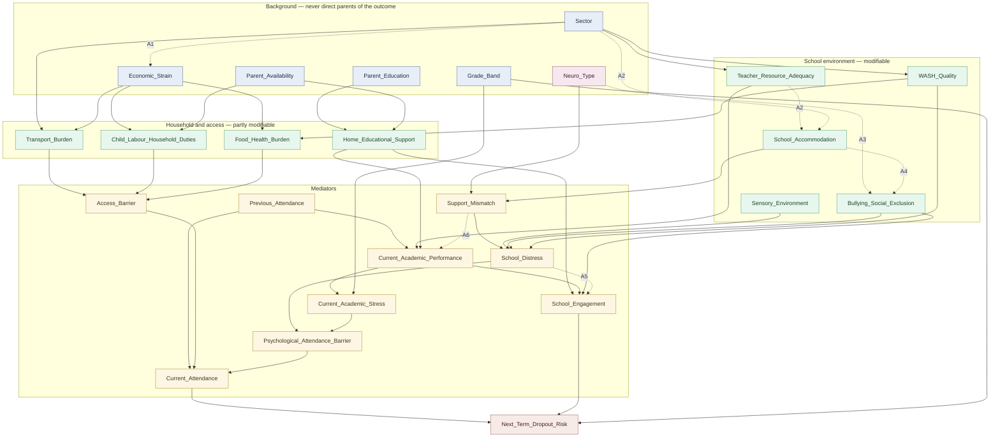

# A Bayesian-network early-support screen for school disengagement in Sri Lanka

**Critical review, implementation, and limitations**

> **Status of every number in this document.** All probabilities are *illustrative
> expert-elicited priors for software testing; not validated Sri Lankan prevalence
> estimates.* They exist so the software can be exercised end to end. Nothing here is an
> empirical finding about Sri Lankan schools, and no output may be shown to, or used
> about, a real student.

| Artefact | Path |
|---|---|
| Implementation | `dropout_ews_bn.py` |
| Tests (133, all passing) | `test_dropout_ews_bn.py` |
| Machine-readable results | `outputs/analysis_results.json` |
| Synthetic cohort (10,000 records) | `outputs/synthetic_students_SYNTHETIC.csv` |
| Cohort provenance | `outputs/synthetic_students_SYNTHETIC.metadata.json` |

Environment: Python 3.12, pgmpy 1.1.2, pandas 3.0.5, numpy 2.5.1. Reproduce with
`python dropout_ews_bn.py --out-dir outputs` and `pytest -q test_dropout_ews_bn.py`.

---

## Headline findings

Three results from this work matter more than the model itself.

1. **As specified, the network is nearly blind to its own most important modifiable
   lever.** Switching school accommodation from inadequate to adequate for an ASD student
   moves `Support_Mismatch` by 0.566 — a decisive shift — but moves the outcome by only
   **0.0063**. Just **1.1%** of the signal survives the five-edge chain from accommodation
   to the outcome. Scenario A, which the brief calls the ethically important comparison, is
   therefore invisible to any realistic triage threshold. This is arithmetic, not a coding
   error (§1, C5).

2. **Two omitted edges cause most of that loss.** The brief gives accommodation *no
   academic pathway at all* and routes distress to the outcome only through attendance —
   the narrowest available channel — discarding the affective pathway entirely. Restoring
   `Support_Mismatch → Current_Academic_Performance` and
   `School_Distress → School_Engagement` raises transmission from 1.1% to **7.9%** (7×),
   putting the inclusion contrast on par with the socio-economic one. The restored
   engagement route carries 5.8× more signal than the attendance route it was missing
   alongside (§1 C5, §3 A5–A6).

3. **`pgmpy.CausalInference.query` cannot be trusted for conditional interventional
   queries in version 1.1.2.** Whenever the intervened variable has parents, it silently
   discards evidence outside its chosen adjustment set. `do(Transport_Burden=Low)` with
   `Previous_Attendance=Irregular` returns P(High)=0.1265 — the no-evidence value — where
   the correct answer is **0.2465**. Nearly a factor of two, with no warning (§8).

Beyond these, the model's own arithmetic shows that at a 0.35 threshold it would refer
**102 of every 1,000 students** for review, and that if the true leaving rate were 2%, at
most **20%** of those referrals could be correct however good the ranking (§11).

---

## 1. Causal-model critique

### 1.1 The six roles a variable can play

The brief asks for these distinctions first, because most of the errors below are
role-confusions rather than arithmetic mistakes.

| Role | Definition | Test that identifies it | Example here |
|---|---|---|---|
| **Causal factor** | Changing it changes the outcome, through some mechanism. Supports `do()`. | Would a hypothetical intervention on it move the outcome? | `School_Accommodation` — a school can change it, and the change propagates. |
| **Predictive indicator** | Carries information about the outcome without necessarily causing it. Supports forecasting only. | Does it improve prediction? Silent on whether acting on it helps. | `Previous_Attendance` — the strongest signal in the model, but *recording* it changes nothing. |
| **Mediator** | Lies on a causal path between exposure and outcome; transmits the effect. | Does conditioning on it *reduce* the exposure's apparent effect? | `Support_Mismatch` mediates accommodation → risk. |
| **Confounder** | A common cause of exposure and outcome. Creates a back-door path; must be adjusted for. | Does it have arrows into *both*? | `Teacher_Resource_Adequacy` confounds accommodation and attainment (in the amended model). |
| **Proxy** | Stands in for an unmeasured construct; inherits the construct's *and* the measurement's biases. | Is it the thing you care about, or a trace of it? | `Sector` proxies structural under-resourcing; `Neuro_Type` proxies *identified* neurodivergence. |
| **Outcome** | The thing to be predicted or prevented. Must be an observable event with a definition someone could check against a record. | Could two people independently assign its value from records? | `Next_Term_Dropout_Risk` — **fails this test as named** (C1). |

Two consequences that recur below. First, **mediators and confounders demand opposite
treatment**: adjust for a confounder, and you remove bias; adjust for a mediator, and you
delete the very effect you are trying to measure. Second, **a good predictor can be a
useless intervention target and a harmful one to act on** — the distinction between
`P(Y|X)` and `P(Y|do(X))` in §8 is exactly this distinction.

### 1.2 Being a DAG is not being causally valid

The brief explicitly asks that this not be claimed, and it is worth being precise about
why. Acyclicity buys exactly one thing: the joint distribution factorises as
∏ P(Xᵢ | Pa(Xᵢ)), so inference is well defined. It buys **nothing** causal. Any ordering
of 25 variables with no cycles is a DAG; there are astronomically many, and almost all are
causally wrong. `check_model()` returning `True` — which it does here — certifies that the
CPD cardinalities match the graph and the columns sum to one. It does not inspect a single
arrow for plausibility.

Causal validity would additionally require that the graph be **causally sufficient** (no
unmeasured common cause of any two variables in it), that every arrow point from cause to
effect rather than the reverse, and that the absence of an arrow be a real claim of no
direct effect. This network satisfies none of these, and the third failure is the quiet
one: **every missing edge is an assumption**, and unlike the present edges the missing ones
are never listed for review. C4 and C5 below are both missing-edge failures.

### 1.3 Findings

Ordered by how much they should change the research plan.

---

**C1 — The outcome node is not an outcome. (Most serious.)**

`Next_Term_Dropout_Risk ∈ {Low, Medium, High}` is a latent score, not an event. This has
three consequences that compound:

- **It cannot be calibrated.** Calibration compares predicted probabilities against
  observed frequencies. There is no observable frequency of "being at Medium risk", so no
  data set can ever tell you the CPD is wrong. The model becomes unfalsifiable.
- **Its CPD is a scoring rubric wearing probability notation.** `P(High | Irregular, Low
  engagement) = 0.83` looks like a probability but has no referent. Presenting it as one
  invites a review team to read it as "83% of such students leave", which it is not.
- **The three states have no operational definition,** so two schools will apply it
  differently and subgroup comparisons become meaningless.

*Recommendation.* Redefine the node as an observable next-term status and keep the name
only for code compatibility. The implementation documents this mapping at
`dropout_ews_bn.py:NODE_STATES`:

| State | Operational definition (proposed) |
|---|---|
| `Low` | Enrolled next term, attendance ≥ 80% |
| `Medium` | Enrolled next term, attendance < 80% (chronic absence) |
| `High` | Not enrolled, or left, with no verified transfer |

Each is checkable from an attendance register and an enrolment record. Once so defined,
the CPD becomes an empirical claim, calibration becomes possible, and §10's plan has
something to calibrate *against*.

---

**C2 — The outcome means different things in different grade bands.**

Sri Lanka has near-universal primary enrolment and compulsory schooling to 16. Genuine
leaving is rare below Grade 9 and concentrates at specific structural junctures — the
Grade 5 scholarship transition, and above all O-Level, after which unsuccessful candidates
exit in numbers. A single `Next_Term_Dropout_Risk` node spanning `Primary` through
`OLevel_ALevel` therefore aggregates three different phenomena: chronic absence in primary,
non-transition at Grade 5, and post-examination exit at O-Level.

The `Grade_Band → Next_Term_Dropout_Risk` edge is carrying all of this implicitly, which is
why it needs the largest coefficients in the model and remains the least interpretable. A
band-stratified outcome definition — or separate models per band — is the correct fix. Note
this also makes the model's rarest and most consequential prediction (primary-age
departure) the one it is worst at, since it is fitted on a scale dominated by O-Level exit.

---

**C3 — `Neuro_Type` is a measurement, and the measurement is unequally available.**

The node is labelled as if it were a trait. What a school records is *identified*
neurodivergence, and identification requires access to assessment — which in Sri Lanka is
concentrated in urban areas, in higher-income households, and in the private sector. So:

```
Sector, Economic_Strain  ──→  Assessment_Access  ──→  Neuro_Type(recorded)
                                                             │
                                              (true neurotype is never observed)
```

The recorded variable is a collider-adjacent proxy whose availability depends on the same
factors that drive risk. The practical consequence is precisely backwards from what the
system intends: **a neurodivergent child in an estate school is less likely to be recorded
as neurodivergent, so the accommodation pathway never fires for them, and the student least
likely to receive support is least likely to be flagged as needing it.** Differential
measurement error here does not add noise; it systematically de-prioritises the most
disadvantaged.

*Recommendations.* (a) Rename to `Identified_Neurodivergence` so no reader mistakes it for
the trait. (b) Record *whether an assessment has occurred* as a separate variable, so
"not identified" and "identified as typical" stop being conflated. (c) Report screening
rates by sector as a standing fairness metric (§11). (d) Never interpret a low flag rate in
estate schools as low need.

Two further problems with the same node: ADHD and ASD co-occur frequently, so mutually
exclusive states force misclassification; and specific learning differences — dyslexia
above all, highly relevant to attainment-driven disengagement — have no state at all.
Two binary indicators would represent reality better than one three-state variable.

---

**C4 — The WASH mechanism the brief describes cannot be represented, because there is no
`Gender` node.**

The brief asks that inadequate WASH be understood to act through "illness, avoidance,
dignity, privacy, menstrual-hygiene barriers, or sensory discomfort", and that not every
student be assumed to experience the same mechanism. But with no gender variable and no
interaction with `Grade_Band`, the menstrual-hygiene pathway — the best-evidenced and most
strongly age-and-gender-specific of the six — is simply absent. `WASH_Quality`'s effect is
a population average over a mechanism that applies sharply to some students and not at all
to others, which understates it for post-menarcheal girls and overstates it for everyone
else.

This is a genuine tension rather than an oversight to fix casually. Adding a protected
characteristic to a risk model is a decision with its own hazards. My recommendation is to
**collect gender but constrain its use**: admit it to the model *only* as an effect modifier
on the WASH → attendance pathway, never as a parent of the outcome, and retain it for
subgroup calibration audits (which are impossible without it). I have deliberately **not**
implemented this in code: it needs ethics-committee sign-off, not a developer's judgement.
Until then, the honest statement is that the model represents WASH effects as
gender-neutral and therefore misrepresents them for everyone.

Also absent, and important in Sri Lanka: **medium of instruction**. Tamil-medium teacher
shortages in estate schools are a well-documented mechanism connecting sector to attainment,
and the model routes sector effects only through `Teacher_Resource_Adequacy` as an
undifferentiated quantity.

---

**C5 — Long mediator chains attenuate the signal to near-invisibility. (Most consequential
in practice.)**

The brief instructs: "Prefer intermediate mechanism nodes rather than CPDs with an
unreasonably large number of parent combinations." That instruction is right for
auditability, and it has a cost the brief does not mention. A Bayesian network transmits a
contrast multiplicatively: the shift at each node is approximately the shift at its parent
times that CPD's local sensitivity. Every local sensitivity is well below 1, so the product
over a long chain collapses.

Measured on the delivered model (`trace_pathway_attenuation`, Scenario A1 vs A2):

| Node on the pathway | P(adverse) unsupported | accommodated | shift |
|---|---|---|---|
| `Support_Mismatch` | 0.8247 | 0.2589 | **0.5658** |
| `School_Distress` | 0.6778 | 0.4278 | 0.2500 |
| `Psychological_Attendance_Barrier` | 0.3076 | 0.2256 | 0.0820 |
| `Current_Attendance` | 0.2363 | 0.2172 | 0.0191 |
| `Next_Term_Dropout_Risk` | 0.1447 | 0.1384 | **0.0063** |

A 0.566 shift arrives as 0.0063 — **1.1% transmission**. The mechanism is not absent; the
outcome node cannot see it. All three Scenario A variants return `argmax = Low`, so a
triage tool would treat an unaccommodated ASD student in an overloading, unsanitary school
identically to a typical student in a good one.

*Diagnosis.* Partly chain length, but mostly two **missing** edges (see A5–A6 in §3):
accommodation has no academic pathway, and distress has no engagement pathway. Restoring
both raises transmission to **7.9%** — a 7× improvement that brings the inclusion contrast
(ΔP(High) = −0.0448) into the same range as the socio-economic contrast (−0.0574). This is
regression-tested at `test_amended_variant_transmits_the_accommodation_signal_better`.

*And the amended model shows which route does the work.* Decay along a single route cannot
increase, so tracing the attendance chain in the amended model produces something that looks
impossible — the shift **grows** from 0.0286 at `Current_Attendance` to 0.0448 at the outcome.
That is not an error; it is positive evidence that signal is arriving outside the traced
chain. There are 4 distinct directed paths from `Support_Mismatch` to the outcome in the
amended structure, and tracing the engagement route instead reveals where the signal actually
travels:

| Route (amended) | shift at last mediator | shift at outcome |
|---|---|---|
| via `Psychological_Attendance_Barrier → Current_Attendance` | 0.0286 | 0.0448 |
| via `School_Distress → School_Engagement` (A5) | **0.1648** | 0.0448 |

The engagement route carries **5.8× more signal** at its final mediator than the attendance
route. The brief's structure routed distress to the outcome *only* through attendance — the
narrowest available channel — and discarded the affective pathway entirely. That, more than
chain length, is why the baseline cannot see inclusion.

`trace_pathway_attenuation` now detects and reports this (`monotone_decay`,
`parallel_pathway_signals`, `n_directed_paths_first_to_last`), refuses to trace a node
sequence that is not a directed path in the model, and is tested in both variants. An
earlier version silently presented the non-monotone amended curve as "attenuation".

*General lesson.* Before elicitation, check that each intended lever can *reach* the
outcome with a shift larger than the resolution a review team can act on. Otherwise the
model is a well-formed instrument measuring nothing.

---

**C6 — `Previous_Attendance` is exogenous, which truncates every background effect.**

`Previous_Attendance` is the strongest input and has no parents. But last term's attendance
was itself caused by economic strain, transport, health, and exclusion — the same variables
whose effects the model is trying to estimate. Severing that history means every reported
background effect is really "the effect *not already mediated by prior attendance*", which
is a systematic **underestimate**, largest for exactly the persistent structural
disadvantages the system is meant to surface.

The node also silently absorbs all unmeasured persistent causes, so it functions as a
lumped proxy for student- and family-level heterogeneity. That makes it a superb predictor
and a treacherous causal quantity.

*Recommendation.* Either add edges from stable background variables (`Economic_Strain`,
`Sector`, `Neuro_Type`) into `Previous_Attendance`, or — better — build a genuine two-period
model with previous-term `Access_Barrier` and `School_Distress`, and report all effects
explicitly as "not mediated by prior attendance" until then. §10 treats this as the primary
structural priority.

---

**C7 — `Food_Health_Burden` bundles two different constructs.**

Food insecurity (driven by income) and illness burden (driven by WASH and healthcare) are
merged. Three costs: the CPD is hard to elicit because "High" means two things;
`do(Food_Health_Burden = Low)` has no interpretation, since school meals and clean water are
different interventions with different costs and owners; and the two components have
different lags. Split into `Nutrition_Insecurity` and `Illness_Burden`, both feeding
`Access_Barrier`. This is straightforward and I would do it before elicitation.

---

**C8 — `School_Engagement` and `Current_Attendance` overlap by definition, and jointly parent
the outcome.**

In most early-warning frameworks attendance *is* one of the operational indicators of
engagement. Here they are separate parents of the outcome with no edge between them, so the
same underlying disengagement is counted twice — inflating `P(High)` when both are adverse,
which is exactly the profile that dominates Scenario C (`ΔP(High) = −0.4417`, by far the
largest contrast in the model). Some of that gap is real signal and some is double counting;
as specified, the two cannot be separated.

*Recommendation.* Define `School_Engagement` from strictly non-attendance indicators
(participation, homework completion, extracurricular involvement, self-reported belonging),
document the definition, and add `School_Distress → School_Engagement` (A5) so the affective
route exists.

---

**C9 — `Sector` under-represents estate disadvantage, in a way that reads as fairness.**

`Sector` acts only through `Transport_Burden`, `Teacher_Resource_Adequacy` and `WASH_Quality`
— a genuinely good design that avoids treating geography as an intrinsic cause. But
Sri Lankan estate-sector disadvantage also runs through household poverty and parental
schooling, and neither `Sector → Economic_Strain` nor `Sector → Parent_Education` is present.
The model therefore *understates* estate risk while appearing more equitable. Since
under-flagging is the harm that attracts no complaints, this is the dangerous direction of
error. A1 adds `Sector → Economic_Strain`; the parental-education edge deserves the same
treatment after review.

---

**C10 — Rare-outcome arithmetic is unaddressed.**

The model's prior is P(High) = 0.132. If the operational definition in C1 is adopted, the
real rate of leaving school in a term is far lower — plausibly 1–2% annually at school
level, and highly band-dependent. A screen whose flag rate exceeds the base rate by an order
of magnitude will produce mostly false positives *by arithmetic*, not by poor tuning. §11
quantifies this and draws the governance conclusion: outputs must lead to *offers*, never to
anything a student can lose.

---

### 1.4 Edge classification

Every edge classified against the requested categories. These groupings are **generated from
`EDGE_EVIDENCE` in the code**, not written out by hand — see the note on drift at the end of
this section. "Sri Lankan evidence" means I judge that retrievable Sri Lankan sources bear on
the mechanism; every such claim still requires retrieval and verification per §12. No level
here means an edge has been *verified*.

Baseline: **13 SL · 13 INT · 9 EXP = 35 edges.** A quarter of the model (25.7%) rests on
unvalidated expert hypothesis. Amended: 14 SL · 16 INT · 12 EXP = 42 edges (28.6% EXP).

**Supported by Sri Lankan evidence (13):**
`Sector → Transport_Burden`, `Sector → Teacher_Resource_Adequacy`, `Sector → WASH_Quality`,
`Economic_Strain → Child_Labour_Household_Duties`, `Economic_Strain → Food_Health_Burden`,
`Economic_Strain → Transport_Burden`, `Parent_Education → Home_Educational_Support`,
`Parent_Availability → Child_Labour_Household_Duties`, `Transport_Burden → Access_Barrier`,
`Child_Labour_Household_Duties → Access_Barrier`, `Access_Barrier → Current_Attendance`,
`Grade_Band → Current_Academic_Stress`, `Grade_Band → Next_Term_Dropout_Risk`.

**Supported mainly by international evidence (13):**
`Parent_Availability → Home_Educational_Support`, `Bullying_Social_Exclusion →
School_Distress`, `Bullying_Social_Exclusion → School_Engagement`, `WASH_Quality →
Food_Health_Burden`, `Food_Health_Burden → Access_Barrier`, `Previous_Attendance →
Current_Attendance`, `Previous_Attendance → Current_Academic_Performance`,
`Teacher_Resource_Adequacy → Current_Academic_Performance`, `Home_Educational_Support →
Current_Academic_Performance`, `Home_Educational_Support → School_Engagement`,
`Current_Academic_Performance → School_Engagement`, `Current_Attendance →
Next_Term_Dropout_Risk`, `School_Engagement → Next_Term_Dropout_Risk`.

**Expert hypothesis requiring validation (9)** — plausible, but not directly evidenced at
this level of specificity:
`Neuro_Type → Support_Mismatch`, `School_Accommodation → Support_Mismatch`,
`Support_Mismatch → School_Distress`, `Sensory_Environment → School_Distress`,
`WASH_Quality → School_Distress`, `School_Distress → Psychological_Attendance_Barrier`,
`Current_Academic_Stress → Psychological_Attendance_Barrier`,
`Psychological_Attendance_Barrier → Current_Attendance`, `Current_Academic_Performance →
Current_Academic_Stress`.

Note what the EXP list contains: **eight of its nine edges either lie on, or feed directly
into, the inclusion pathway** `Neuro_Type/School_Accommodation → Support_Mismatch →
School_Distress → Psychological_Attendance_Barrier → Current_Attendance` — five on the chain
itself, three feeding its nodes (`Sensory_Environment → School_Distress`, `WASH_Quality →
School_Distress`, `Current_Academic_Stress → Psychological_Attendance_Barrier`). The chain
carrying the model's entire
ethical argument is also the least evidenced part of it. It should be the first target for
empirical work, and until then no inclusion finding from this model should be reported
without that caveat attached.

> **Correction (review pass).** An earlier draft of this section classified only 34 of the 35
> edges — `Home_Educational_Support → School_Engagement` was omitted — and disagreed with the
> §2 table on five edges (`Economic_Strain → Food_Health_Burden`, `Parent_Availability →
> Home_Educational_Support`, `Parent_Availability → Child_Labour_Household_Duties`,
> `Food_Health_Burden → Access_Barrier`, `Access_Barrier → Current_Attendance`,
> `Grade_Band → Current_Academic_Stress`). The §2 table was correct in every case. The root
> cause was that evidence levels were written out by hand in two places; they are now data in
> the code (`EDGE_EVIDENCE`), with `test_edge_evidence_covers_every_edge_and_nothing_else`
> and `test_evidence_summary_partitions_the_edge_set` making silent drift impossible.

**Potentially inappropriate as specified — but for reasons of *definition*, not direction.**
No proposed edge points the wrong way. Four need rework before use:

| Edge | Problem | Fix |
|---|---|---|
| `Grade_Band → Next_Term_Dropout_Risk` | Outcome means different things per band (C2) | Stratify the outcome definition |
| `WASH_Quality → School_Distress` | Cannot carry the MHM mechanism without gender (C4) | Add gender as a constrained effect modifier |
| `Economic_Strain → Food_Health_Burden` | Child node conflates nutrition and illness (C7) | Split the node |
| `School_Engagement → Next_Term_Dropout_Risk` | Double counts attendance (C8) | Redefine engagement without attendance |

`Neuro_Type → Support_Mismatch` deserves a specific defence, since it is the edge most
likely to be challenged. It is appropriate **only** because `Support_Mismatch` is defined as
a property of the *fit* between learner and setting, and only because
`School_Accommodation` enters the same CPD with a strong interaction. Under those two
conditions the edge says "this student needs different things from the environment", not
"this student is a risk". Remove the interaction, and the same edge becomes a claim that
neurodivergence causes dropout. The distinction is carried entirely by the CPD, which is
why it is enforced by tests
(`test_accommodated_neurodivergent_student_is_not_automatically_distressed`) rather than
left to the structure.

---

## 2. Edge-justification table

Baseline structure: 25 nodes, 35 edges, 10 roots. Largest CPD 16 columns; deepest node 4
parents. Evidence levels: **SL** Sri Lankan evidence · **INT** international evidence ·
**EXP** expert hypothesis requiring validation.

| # | Parent | Child | Proposed mechanism | Ev. | Potential confounders | Modifiable? | Ethical / fairness concern |
|---|---|---|---|---|---|---|---|
| 1 | `Sector` | `Transport_Burden` | Distance, terrain, bus frequency and fare cost rise from urban to rural to estate | SL | Household location choice; road investment | Partly — bus subsidy, hostels, siting | Sector is a proxy for structural neglect; must not read as a trait of rural/estate families |
| 2 | `Sector` | `Teacher_Resource_Adequacy` | Deployment, subject specialists and medium-of-instruction coverage thin out outside urban schools | SL | Teacher preference; school size; political allocation | Yes — deployment policy, incentives | Risk of ranking or penalising schools for a resourcing failure not of their making |
| 3 | `Sector` | `WASH_Quality` | Water supply, toilet ratios and MHM facilities weaker in small rural/estate schools | SL | School age and size; capital budget cycles | Yes — capital investment | Same as #2; also dignity-sensitive |
| 4 | `Economic_Strain` | `Child_Labour_Household_Duties` | Income pressure converts into paid work and unpaid household/sibling care | SL | Local labour demand; household composition; shocks | Yes — cash transfers, meals, enforcement | Must never trigger punitive action against families (§11) |
| 5 | `Economic_Strain` | `Food_Health_Burden` | Food insecurity driven by income | SL | Food prices; agricultural season; safety nets | Yes — school meals | Node conflates nutrition and illness (C7) |
| 6 | `Economic_Strain` | `Transport_Burden` | Ability to pay fares | SL | Fuel/fare policy | Yes — subsidy | — |
| 7 | `Parent_Education` | `Home_Educational_Support` | Capacity to help with schoolwork and to negotiate with the school | SL | Intergenerational SES; parental literacy in medium of instruction | Not for the child — but substitutable via school support | **Must be read as opportunity, not as how much a family values education.** Deficit framing is the main hazard in this whole model |
| 8 | `Parent_Availability` | `Home_Educational_Support` | A present caregiver can supervise and advocate | INT | Migration selection; family structure | Partly — after-school support | Migrant-worker families (esp. mothers abroad) must not be stigmatised |
| 9 | `Parent_Availability` | `Child_Labour_Household_Duties` | Absent caregiver transfers household and sibling care to the child | SL | As #8; birth order; gender norms | Partly — childcare provision | Gendered burden is invisible without a gender variable (C4) |
| 10 | `Neuro_Type` | `Support_Mismatch` | Different learners need different things from the setting | EXP | **Assessment access (C3)** — differential identification | No, and never a `do()` target | Appropriate *only* with the accommodation interaction present; otherwise becomes "neurodivergence causes dropout" |
| 11 | `School_Accommodation` | `Support_Mismatch` | Accommodations close the gap between need and provision | EXP | Teacher capacity; school leadership; catchment SES | **Yes — the primary lever** | Under-provision must not be recoded as student deficit |
| 12 | `Support_Mismatch` | `School_Distress` | Sustained unmet need is distressing | EXP | Baseline temperament; home stressors | Via #11 | Distress is not a diagnosis; must not enter any health record without consent |
| 13 | `Sensory_Environment` | `School_Distress` | Noise, crowding, heat, lighting raise load | EXP | Class size; building age; correlates with #2, #3 | Yes — low-cost adjustments | — |
| 14 | `Bullying_Social_Exclusion` | `School_Distress` | Peer victimisation is directly distressing | INT | Supervision; school climate; **neurotype (A3)** | Yes — anti-bullying practice | Must never be recorded in a way that identifies or penalises the victim |
| 15 | `WASH_Quality` | `Food_Health_Burden` | Water and sanitation quality drive illness episodes | INT | Community WASH; nutrition; seasonality | Yes | — |
| 16 | `WASH_Quality` | `School_Distress` | Indignity, lack of privacy, MHM barriers, sensory discomfort | EXP | **Gender and pubertal status — unmodelled (C4)** | Yes | Population-averaging a sharply gender-specific mechanism misrepresents it for all students |
| 17 | `Transport_Burden` | `Access_Barrier` | Cannot reliably get to school | SL | Weather; safety; sibling escort | Yes | — |
| 18 | `Child_Labour_Household_Duties` | `Access_Barrier` | Needed elsewhere during school hours | SL | Seasonality; employer demand | Yes | Detection must trigger support, never prosecution of the family |
| 19 | `Food_Health_Burden` | `Access_Barrier` | Illness and hunger prevent attendance | INT | Healthcare access; distance to clinic | Yes | Health data is special-category (§11) |
| 20 | `School_Distress` | `Psychological_Attendance_Barrier` | School avoidance as a response to a distressing setting | EXP | Home mental-health context; prior trauma | Via upstream levers | **Must be framed as avoidance, never as truancy or defiance** |
| 21 | `Current_Academic_Stress` | `Psychological_Attendance_Barrier` | Avoidance of academic failure and shame | EXP | Exam pressure; private tuition culture | Partly | — |
| 22 | `Previous_Attendance` | `Current_Attendance` | Strong term-to-term persistence in habit and circumstance | INT | **All persistent unmeasured causes (C6)** | Historical — not modifiable | Its dominance means the model largely re-flags the already-flagged |
| 23 | `Access_Barrier` | `Current_Attendance` | Practical inability to attend | SL | — | Via #17–19 | — |
| 24 | `Psychological_Attendance_Barrier` | `Current_Attendance` | Distress-driven non-attendance | EXP | — | Via #20–21 | — |
| 25 | `Previous_Attendance` | `Current_Academic_Performance` | Lost instructional time depresses attainment | INT | Prior attainment; ability tracking | Historical | — |
| 26 | `Teacher_Resource_Adequacy` | `Current_Academic_Performance` | Teaching capacity drives learning | INT | Catchment SES; peer effects; selection | Yes | Do not convert into school league tables |
| 27 | `Home_Educational_Support` | `Current_Academic_Performance` | Scaffolding and homework supervision | INT | Parental education; tuition access | Partly | Deficit-framing hazard as #7 |
| 28 | `Current_Academic_Performance` | `Current_Academic_Stress` | Falling behind is stressful | EXP | Aspiration; comparison; parental pressure | Via #26–27 | — |
| 29 | `Grade_Band` | `Current_Academic_Stress` | Public-examination stakes amplify stress | SL | Cohort effects; tuition intensity | No | — |
| 30 | `Current_Academic_Performance` | `School_Engagement` | Work that feels impossible erodes effort | INT | Belonging; teacher relationships | Via #26–27 | — |
| 31 | `Home_Educational_Support` | `School_Engagement` | Encouragement sustains engagement | INT | As #27 | Partly | As #7 |
| 32 | `Bullying_Social_Exclusion` | `School_Engagement` | Social unsafety destroys belonging | INT | School climate; neurotype (A3) | Yes | As #14 |
| 33 | `Current_Attendance` | `Next_Term_Dropout_Risk` | Chronic absence is the classic precursor | INT | **Definitional overlap with engagement (C8)** | Via #23–24 | Dominant driver; near-tautological if the outcome is attendance-defined (C1) |
| 34 | `School_Engagement` | `Next_Term_Dropout_Risk` | Disengagement precedes leaving | INT | As #33 | Via #30–32 | Double counting inflates the highest-risk profile |
| 35 | `Grade_Band` | `Next_Term_Dropout_Risk` | Structural exit points at Grade 5 and O-Level | SL | Cohort; policy changes; exam timing | No | Carries C2's aggregation problem; the least interpretable edge in the model |

**Amendment edges (§3), same columns:**

| # | Parent | Child | Mechanism | Ev. | Confounders | Modifiable? | Ethical concern |
|---|---|---|---|---|---|---|---|
| A1 | `Sector` | `Economic_Strain` | Poverty concentrated in estate/rural sectors | SL | Regional development; migration | Policy-level only | Corrects an under-estimate of estate risk (C9) |
| A2 | `Teacher_Resource_Adequacy`, `Sector` | `School_Accommodation` | Accommodations need trained staff, time and sited specialist support | EXP | School leadership; catchment SES | Yes | Makes accommodation *confounded*, so §8's distinction stops being vacuous |
| A3 | `Neuro_Type` | `Bullying_Social_Exclusion` | Neurodivergent students are victimised at markedly higher rates | INT | Supervision; school climate; identification (C3) | The bullying, yes | **Encodes what is done to students, not what they cause.** Must be presented as victimisation |
| A4 | `School_Accommodation` | `Bullying_Social_Exclusion` | Schools that accommodate well also supervise and intervene better | EXP | Leadership; staffing | Yes | — |
| A5 | `School_Distress` | `School_Engagement` | A distressed student disengages; the affective route to belonging | INT | Home stressors; temperament | Via upstream | Restores a pathway whose absence made the model blind to inclusion (C5) |
| A6 | `Support_Mismatch` | `Current_Academic_Performance` | Unaccommodated need blocks curriculum access | INT | Prior attainment; identification | Via accommodation | **The most important omission in the brief**: accommodations exist primarily so a student can *learn* |

---

## 3. Final DAG

Baseline: 25 nodes / 35 edges (fingerprint `c1b90a89…`). Amended: 25 nodes / 42 edges — the
six amendments A1–A6, of which A2 contributes two edges (fingerprint `f12dd7f4…`). Both pass
`check_model()`.



Solid arrows are the brief's required edges; dashed arrows labelled A1–A6 are the
critique-driven amendments (`--variant amended`).

**Structural properties verified by tests.** `Neuro_Type` has no direct edge to the outcome,
and every path from it to the outcome runs through `Support_Mismatch`, `School_Distress` or
`Bullying_Social_Exclusion` — mechanisms a school can change. No protected characteristic
except `Grade_Band` parents the outcome. No same-period attendance/performance cycle exists.
No node exceeds 4 parents or 16 CPD columns, so every CPD is human-reviewable.

---

## 4. Complete executable Python code

`dropout_ews_bn.py` — single module, no global mutable state, type-hinted, `logging`
throughout, fixed seed (`RANDOM_SEED = 20250725`).

| Function | Role |
|---|---|
| `build_structure(variant)` | DAG only; validates node registry, acyclicity (naming any cycle), and the no-protected-shortcut rule |
| `build_cpds(variant)` | One CPD per node from declarative specs |
| `validate_cpds(cpds)` | Range, normalisation, **and no exact 0 or 1** |
| `build_model(variant)` | Assembles and validates; returns a frozen `RiskModel` with a warm inference engine and a parameter fingerprint |
| `generate_synthetic_data(...)` | Forward sampling with synthetic markers |
| `infer_dropout_risk(...)` | Observational posterior; FastAPI-shaped |
| `estimate_intervention_effect(...)` | `do()` on the mutilated graph, restricted to an allowlist |
| `compare_scenarios(...)` | The A/B/C battery with within-group contrasts |
| `run_sensitivity_analysis(...)` | ±10% one-at-a-time, reporting rank stability |
| `trace_pathway_attenuation(...)` | The C5 diagnostic, incl. parallel-route detection |
| `estimate_screening_burden(...)` | Flag rates and precision ceilings |
| `summarise_evidence_levels(...)` | Generates §1.4's classification from `EDGE_EVIDENCE` |
| `audit_pgmpy_causal_api(...)` | Probes the library bug in §8 |
| `main(argv)` | Runs everything; writes `analysis_results.json` and the cohort |

Three design choices worth flagging:

**A frozen bundle rather than module state.** `RiskModel` is an immutable dataclass holding
the network, a pre-built `VariableElimination` engine, and a content fingerprint over
structure *and* parameters. Build it once in a FastAPI lifespan handler and share it across
requests; there is nothing to mutate, so nothing to race. The fingerprint means an audit log
can later prove which parameter set produced a given number — changing one probability
changes the hash, which is regression-tested.

**Declarative CPD specs instead of matrices.** See §5.

**Strict evidence validation with a catchable base class.** `UnknownNodeError` and
`UnknownStateError` both derive from `EvidenceError(ValueError)`, so a route handler catches
one type and returns 422. Unknown-state messages list the legal states, so an API client
can self-correct. Supplying the query target as evidence is rejected.

Every inference result is JSON-native and carries `model_fingerprint`, `model_variant`,
`computed_at`, `interpretation` (`observational_conditional` vs `interventional_do`), the
provenance banner, and a caveat string. The caveat travels *with the number* so it cannot be
detached by a downstream UI.

### Minimal FastAPI integration

```python
from contextlib import asynccontextmanager
from fastapi import FastAPI, HTTPException
from pydantic import BaseModel
import dropout_ews_bn as bn

@asynccontextmanager
async def lifespan(app: FastAPI):
    app.state.risk_model = bn.build_model()   # built once; immutable; thread-safe
    yield

app = FastAPI(lifespan=lifespan)

class ScreenRequest(BaseModel):
    evidence: dict[str, str]

@app.post("/screen")
def screen(request: ScreenRequest):
    try:
        return bn.infer_dropout_risk(app.state.risk_model, request.evidence)
    except bn.EvidenceError as exc:
        raise HTTPException(status_code=422, detail=str(exc)) from exc

@app.post("/intervention")
def intervention(variable: str, state: str, request: ScreenRequest):
    try:
        return bn.estimate_intervention_effect(
            app.state.risk_model, {variable: state}, request.evidence
        )
    except bn.NonModifiableInterventionError as exc:
        raise HTTPException(status_code=403, detail=str(exc)) from exc
    except bn.EvidenceError as exc:
        raise HTTPException(status_code=422, detail=str(exc)) from exc
```

`403` rather than `422` for a non-modifiable intervention is deliberate: asking the model
what would happen if a child were not autistic is not a malformed request but a forbidden
one.

---

## 5. CPD rationale

> Illustrative expert-elicited priors for software testing; not validated Sri Lankan
> prevalence estimates.

### 5.1 Why not matrices

`School_Distress` has 4 parents and 16 conditional columns. Hand-writing 32 numbers is
unreviewable and a single transposition is undetectable by any normalisation check. Instead
each binary node is declared as an **additive log-odds model**:

```
logit P(X = adverse | pa) = logit(baseline) + Σ β[parent, state] + Σ γ[interaction]
```

with a strict clip of (0.02, 0.97). What a reviewer must check shrinks from 32 opaque
numbers to one baseline plus four coefficients, each attached to a written rationale in the
source. Reference levels are implicit: any parent state not listed contributes 0.

The three-state ordered nodes use a **cumulative logit** (proportional odds): one latent
severity score plus two cutpoints. This keeps state *ordering* meaningful — a free 3×12
matrix can express "Medium is less likely than both Low and High", which is incoherent for
an ordered risk band. Monotonicity of the cumulative distribution is tested directly.

Both helpers are verified against closed-form hand computations
(`test_binary_helper_reproduces_hand_computed_logistic`,
`test_ordinal_helper_reproduces_hand_computed_cumulative_logit`), so the abstraction cannot
drift from its own definition.

### 5.2 The interaction that carries the ethics

`Support_Mismatch | Neuro_Type, School_Accommodation` is the only place in the model where
the fairness commitment is actually encoded, so it is worth showing in full:

| `Neuro_Type` | `School_Accommodation` | log-odds | P(mismatch = High) |
|---|---|---|---|
| Typical | Adequate | −2.752 | 0.060 |
| Typical | Inadequate | −1.452 | 0.190 |
| ADHD | Adequate | −1.352 | 0.206 |
| ADHD | Inadequate | +0.948 | 0.721 |
| ASD | Adequate | −1.052 | 0.259 |
| ASD | Inadequate | +1.548 | **0.825** |

The interaction terms (+1.00 for ADHD, +1.30 for ASD with inadequate accommodation) do the
ethical work. An ASD student in an accommodating school sits at 0.259 — closer to a typical
student in a *non*-accommodating school (0.190) than to an ASD student in one (0.825).
**Most of the modelled disadvantage is the setting, not the student.** Remove the
interaction and the same graph asserts that neurodivergence causes dropout. Because the
claim lives in parameters rather than structure, it is enforced by tests rather than trusted:
`test_accommodated_neurodivergent_student_is_not_automatically_distressed` requires that the
gap to a typical peer in the same supportive setting be *smaller* than the gap created by
withdrawing support.

### 5.3 Encoded monotonicity, all executable

| Required behaviour | Encoding | Test |
|---|---|---|
| Higher strain → more child labour and health burden | β(Moderate) < β(High) | `test_economic_strain_is_monotone_in_labour_and_health_burden` |
| Accommodation reduces mismatch for ADHD/ASD | Negative interaction, Δ > 0.30 | `test_adequate_accommodation_reduces_support_mismatch` |
| Supportive sensory environment reduces distress | β(Overloading) = +0.90 | `test_supportive_sensory_environment_reduces_distress` |
| Bullying ↑ distress, ↓ engagement | β = +1.60 / +1.40 | `test_bullying_raises_distress_and_lowers_engagement` |
| Barriers → irregular attendance | β = +1.70 / +1.50, joint Δ > 0.20 | `test_access_and_psychological_barriers_raise_irregular_attendance` |
| Irregular + disengaged = highest risk | η = +2.60 / +2.00, cutpoints (2.20, 4.20) | `test_irregular_attendance_with_low_engagement_is_the_worst_profile` |
| No probability exactly 0 or 1 | Clip (0.02, 0.97); floor 0.005 | `test_no_deterministic_zero_or_one` |

The clip deserves an ethical note, not just a numerical one. A zero asserts that a
combination of circumstances is *impossible*; no elicited prior about a child's life earns
that, and a single zero can render otherwise informative evidence unusable. `validate_cpds`
rejects exact 0 and 1 by default.

### 5.4 The strongest CPD is also the most consequential

`Next_Term_Dropout_Risk | Current_Attendance, School_Engagement, Grade_Band` — cutpoints
(2.20, 4.20), η increments: Irregular +2.60, Low engagement +2.00, Junior_Secondary +0.50,
OLevel_ALevel +1.20.

| Attendance | Engagement | Grade band | Low | Medium | High |
|---|---|---|---|---|---|
| Regular | High | Primary | 0.900 | 0.085 | 0.015 |
| Irregular | High | Primary | 0.401 | 0.431 | 0.168 |
| Regular | Low | OLevel_ALevel | 0.269 | 0.462 | 0.269 |
| Irregular | Low | OLevel_ALevel | 0.027 | 0.141 | **0.832** |

This single CPD dominates the model — §9 shows it is the only parameter whose ±10%
perturbation moves any posterior by more than 0.006. Combined with C8 (attendance and
engagement overlap by definition) and C1 (the outcome is not observable), it is where
calibration effort should start.

---

## 6. Synthetic-data generation

10,000 records via `BayesianModelSampling.forward_sample(seed=20250725)`, written to
`outputs/synthetic_students_SYNTHETIC.csv`.

Synthetic status is recorded **four** times over, so it survives renaming, partial copying,
or opening in a spreadsheet: in the filename, in `is_synthetic` on every row, in
`data_class = SYNTHETIC_NOT_REAL_STUDENT_DATA` on every row, and in a sidecar
`.metadata.json` carrying the generating fingerprint, the seed, the provenance banner,
marginal distributions, and explicit `permitted_uses` / `prohibited_uses` lists. IDs are
sequential (`SYNTH-000001`); no name, NIC, address, date of birth, school name or index
number field exists, and a test asserts no column name contains such a token.

Sampled marginals match the model's exact marginals within sampling error (tested), and
generation is reproducible under a fixed seed (tested).

**What this data cannot do.** It was generated *from* the CPDs, so fitting the same
structure back to it recovers the assumptions and nothing else — with a large enough sample,
perfectly. Any accuracy, AUC or calibration statistic computed on it measures the sampler,
not the world. This is stated in the module docstring, in the sidecar's
`prohibited_uses`, and in §10.5. Its legitimate uses are integration tests, load testing,
teaching, and demonstrating the pipeline before real data exists.

---

## 7. Inference examples

`VariableElimination`, baseline variant. Full records in `outputs/analysis_results.json`.

**Prior (no evidence):** Low 0.624 · Medium 0.244 · High 0.132.

### Scenario A — environmental mismatch

| Scenario | Evidence | Low | Medium | High | argmax |
|---|---|---|---|---|---|
| A1 ASD, unsupported | ASD, WASH inadequate, sensory overloading, accommodation **inadequate** | 0.6052 | 0.2500 | 0.1447 | Low |
| A2 ASD, accommodated | same, accommodation **adequate** | 0.6145 | 0.2471 | 0.1384 | Low |
| A3 Typical, same school | Typical, same poor conditions | 0.6156 | 0.2467 | 0.1377 | Low |

Contrasts: A2 − A1 = **−0.0063** (−4.3%); A3 − A1 = −0.0071 (−4.9%).

**Why A2 is the ethically important comparison.** A1 vs A3 asks "how much riskier is an ASD
student?" — a question whose answer is a property of the child and cannot be acted on
without acting on the child. A1 vs A2 holds the student fixed and changes only what the
school provides. It asks the actionable question: *how much of this risk is ours to
remove?* The ordering A1 > A2 > A3 with (A2 − A3) < (A1 − A2) is the quantitative form of
the claim that the barrier is environmental — the fixable gap exceeds the residual
difference — and it is enforced by `test_scenario_a_isolates_the_environment_from_the_neurotype`.

**But note the magnitude, honestly.** 0.0063 is not an actionable difference, and all three
scenarios return `argmax = Low`. The ethically important comparison is, in the baseline
model, *practically invisible*. That is finding C5, not a presentational quibble. Under the
amended structure the same contrast is **−0.0448** (A1 0.2147 → A2 0.1699), seven times
larger and comparable to the socio-economic contrast.

### Scenario B — socio-economic access barriers

| Scenario | Low | Medium | High |
|---|---|---|---|
| B1 High strain + high duties + high transport burden | 0.5564 | 0.2669 | 0.1767 |
| B2 High strain, both barriers relieved | 0.6366 | 0.2396 | 0.1238 |

ΔP(High) = **−0.0530** (−30.0%). Economic strain is held constant, so this isolates the
effect of *relieving the barriers strain produces* rather than of removing poverty. That is
the right framing for a school-level system: the school cannot change household income, but
transport support and household-duty relief are within reach of a welfare programme.

### Scenario C — protective factors

| Scenario | Low | Medium | High | argmax |
|---|---|---|---|---|
| C1 Irregular, unprotected | 0.0581 | 0.2449 | 0.6971 | High |
| C2 Irregular, protected | 0.3038 | 0.4408 | 0.2554 | Medium |

ΔP(High) = **−0.4417** (−63.4%), and the argmax moves from High to Medium — the largest
effect in the model, and the only contrast that changes a triage decision. Two caveats.
First, C2 conditions directly on `School_Engagement = High`, a *mediator*, so this is a
conditional comparison, not the effect of an intervention. Second, per C8, engagement and
attendance overlap by definition, so part of this gap is double counting. Treat it as an
upper bound.

### Cross-scenario ranking

`C1 > C2 > B1 > A1 > A2 > A3 > B2` — stable under all 8 sensitivity perturbations (§9).

---

## 8. Observational versus interventional interpretation

### 8.1 The distinction

`P(Dropout | School_Accommodation = Adequate)` is a statement about **students we happen to
observe** in accommodating schools. `P(Dropout | do(School_Accommodation = Adequate))` is a
statement about **what happens if we provide accommodations**. They differ whenever
something causes both accommodation and dropout, because the observational quantity mixes
the effect of accommodation with the effect of whatever else accommodating schools have.

In real Sri Lankan schools, accommodation is *not* randomly assigned. Schools that provide
it tend to have more trained staff, smaller classes, more engaged parents, and better-off
catchments. So the observational contrast would substantially overstate what a school
gains by adding accommodations alone. Only the interventional quantity answers the policy
question, and getting it requires cutting the arrows *into* accommodation — the mutilated
graph.

### 8.2 An uncomfortable finding about the specified DAG

In the baseline structure, `School_Accommodation` is a **root** — it has no parents. So
there is no back-door path, the mutilated graph equals the original, and:

| Variable | Parents in baseline | max abs difference (do − obs) | Identical? |
|---|---|---|---|
| `Bullying_Social_Exclusion` | none | 0.0000 | **Yes** |
| `School_Accommodation` | none | 0.0000 | **Yes** |
| `Child_Labour_Household_Duties` | 2 | 0.0013 | No |
| `Food_Health_Burden` | 2 | 0.0010 | No |

**The distinction is algebraically vacuous for the model's two most important levers.** Not
because interventions and observations coincide in reality, but because the DAG assumes
accommodation and bullying arrive from nowhere. The absence of a confounder edge is a
positive claim — "nothing causes both this and the outcome" — and it is the strongest,
least examined claim in the whole model.

The amendment A2 (`Teacher_Resource_Adequacy → School_Accommodation`, `Sector →
School_Accommodation`) fixes this. With accommodation confounded, the two quantities
separate: obs P(High) = 0.1346 vs do 0.1371, and for ASD students 0.1563 vs 0.1589. The
observational figure is the *more optimistic* one — exactly the bias direction predicted,
since conditioning on adequate accommodation also selects for schools with adequate
teachers. Small in magnitude here, but the sign and mechanism are the point: a model with
no confounder edges cannot exhibit confounding bias, and will therefore always report that
its levers work better than they do.

### 8.3 Implementation, and a library bug

`estimate_intervention_effect` computes `do()` by **truncated factorisation**: cut the edges
into the intervened variable, then condition on its assigned state in the mutilated graph.
Since the variable is a root there, this is exactly the do-distribution, and its now-irrelevant
marginal cancels in the normalisation (guaranteed well defined because no CPD entry is zero).
Verified against an independent hand-rolled computation in
`test_truncated_factorisation_matches_manual_mutilated_graph`.

The brief asks to use the installed pgmpy's intervention functionality where supported. It
is available — and **it is not safe to use as specified**. In pgmpy 1.1.2,
`CausalInference.query(variables, do=..., evidence=...)` honours `evidence` only for
variables inside the back-door adjustment set it selects, and **silently discards the rest**,
whenever the intervened variable has parents:

| `do(Transport_Burden = Low)` with evidence | Truncated factorisation | pgmpy `CausalInference` | Agrees? |
|---|---|---|---|
| *(none)* | 0.1265 | 0.1265 | ✔ |
| `Sector = Estate` | 0.1301 | 0.1301 | ✔ (in the adjustment set) |
| `Neuro_Type = ASD` | 0.1303 | 0.1265 | ✘ |
| `Previous_Attendance = Irregular` | **0.2465** | **0.1265** | ✘ (out by ~1.95×) |

No exception, no warning — just the no-evidence answer returned for a conditional query.
Interventions on *parentless* variables are unaffected, which is what makes the bug easy to
miss: the natural first test passes.

The module therefore uses pgmpy's engine only as a no-evidence cross-check, where the two
agree exactly, and records the outcome in every result's `pgmpy_cross_check` field.
`audit_pgmpy_causal_api` probes the behaviour on the live model, and
`test_pgmpy_causal_api_audit_reports_the_known_discrepancy` **fails if a future pgmpy fixes
it** — so the workaround cannot outlive its justification.

### 8.4 The guardrail

Interventions are restricted to an **allowlist** (`MODIFIABLE_NODES`), not a denylist, so a
newly added node is non-intervenable until someone deliberately justifies it. Attempting
`do(Neuro_Type = Typical)` raises `NonModifiableInterventionError`, as does any attempt on
`Sector`, `Grade_Band` or `Parent_Education` — tested for every protected variable.

This is not defensive programming; it is the model's ethical position expressed as a type
error. A system that can compute "risk if this child were not autistic" will eventually be
asked to, and the answer would frame the child as the problem. The question is refused at
the API boundary and returns HTTP 403.

Effects of permitted interventions on an illustrative high-need profile (ASD, estate sector,
high economic strain, irregular prior attendance, junior secondary):

| Intervention | P(High) | Δ |
|---|---|---|
| *(no intervention, observational)* | 0.2896 | — |
| `do(Home_Educational_Support = Adequate)` | 0.2622 | −0.0274 |
| `do(Bullying_Social_Exclusion = Low)` | 0.2634 | −0.0262 |
| `do(Transport_Burden = Low)` | 0.2686 | −0.0211 |
| `do(Child_Labour_Household_Duties = Low)` | 0.2753 | −0.0144 |
| `do(WASH_Quality = Adequate)` | 0.2840 | −0.0057 |
| `do(School_Accommodation = Adequate)` | 0.2848 | −0.0049 |
| **`do(` full inclusion package `)`** | **0.2065** | **−0.0831** |

Two observations. The package (−0.0831) exceeds the sum of the parts, because barriers
combine super-additively in the logistic CPDs — consistent with the practical experience
that partial support often fails. And `do(School_Accommodation)` ranks *last* among single
interventions, at −0.0049. Read against C5, this is not a finding about accommodation; it is
the attenuation defect, and it is why the amendments matter.

---

## 9. Sensitivity analysis

Eight perturbations: four parameter groups × ±10% relative, each rebuilt into a complete
model and re-run across the full scenario battery.

| Perturbed parameter | ±10% | max abs shift in P(High) | Most affected | Ranking preserved? |
|---|---|---|---|---|
| `P(Support_Mismatch=High \| Accommodation=Inadequate)` | ∓ | 0.0009 | A1 | ✔ |
| `P(Food_Health_Burden=High \| WASH=Inadequate)` | ∓ | 0.0005 | A1 | ✔ |
| `P(Access_Barrier=High \| Child_Labour=High)` | ∓ | 0.0058 | B1 | ✔ |
| `P(Next_Term_Dropout_Risk=High \| Attendance=Irregular)` | ∓ | **0.0697** | C1 | ✔ |

**Scenario rankings are preserved under all 8 perturbations** (0 rank changes). Read
carefully, though — the result is less reassuring than it looks:

1. **The dispersion spans two orders of magnitude** (0.0005 to 0.0697). The outcome CPD is
   ~140× more influential than the WASH pathway. This is not robustness; it is
   *concentration*. Essentially all of the model's behaviour rests on one CPD — the one
   whose outcome node is not observable (C1) and whose two main parents overlap by
   definition (C8). Calibration effort should be allocated in this proportion, not evenly.

2. **Rank stability is partly an artefact of the scenarios being far apart.** C1 (0.697)
   and B2 (0.124) cannot swap under a 0.07 perturbation. The Scenario A trio, separated by
   0.0063, is a different matter: a perturbation of 0.0009 is 14% of that gap, so the
   *ethically important* comparison is the one whose ordering is least secure. Rank
   stability across well-separated scenarios says little about the comparison that matters.

3. **±10% is not a credible interval.** It is an arbitrary band. Genuine expert uncertainty
   on the mediator-chain parameters (§1.4, all EXP) is far wider — plausibly ±50% or more —
   and the analysis says nothing about that range.

4. **One-at-a-time cannot detect compensating misspecification.** Two parameters wrong in
   opposite directions will pass every test here. Joint perturbation and sensitivity
   functions in the Chan–Darwiche sense are needed before any deployment claim.

5. **Structural uncertainty dominates parameter uncertainty, and is not measured here at
   all.** The largest ±10% effect is 0.0697. Adding two edges (A5, A6) changed the Scenario
   A contrast by a factor of seven. Which edges exist matters far more than their exact
   coefficients — so a sensitivity analysis over parameters alone addresses the smaller
   problem.

---

## 10. Validation and deployment recommendations

### 10.1 What must happen before this touches a real student

In order, non-negotiable:

1. **Redefine the outcome as observable** (C1). Nothing downstream is possible without
   this; an unfalsifiable target cannot be calibrated, audited, or appealed.
2. **Ethics-committee and Ministry approval**, with informed consent and a lawful basis
   under the Personal Data Protection Act No. 9 of 2022 (§11).
3. **Fix the structural defects** — at minimum A5 and A6 (C5), the `Food_Health_Burden`
   split (C7), and a decision on gender in the WASH pathway (C4).
4. **Replace every CPD** with parameters estimated from data (§10.3).
5. **Validate on held-out real data**, including subgroup calibration (§10.4).
6. **Only then** consider a shadow-mode pilot, where outputs are recorded but shown to
   nobody, and compared against what review teams concluded independently.

### 10.2 Data sources for calibration

| Source | Calibrates | Note |
|---|---|---|
| Longitudinal attendance registers | `Previous_Attendance`, `Current_Attendance`, and the outcome under C1's definition | The single highest-value source; already collected |
| Grade progression and repetition records | `Current_Academic_Performance`, `Grade_Band` transitions | Distinguishes repetition from leaving |
| Transfer and school-leaving records | The outcome | **Critical:** an unverified transfer is indistinguishable from leaving, and this misclassification is not random — it correlates with migration and poverty |
| School WASH audits | `WASH_Quality` | Facility-level, objective, already conducted |
| Transport / catchment data | `Transport_Burden` | Distance and route data are derivable without asking families |
| Household surveys (HIES-style) | `Economic_Strain`, `Parent_Education`, `Parent_Availability` | Use existing national instruments; do not build a new one |
| Child activity surveys | `Child_Labour_Household_Duties` | Highest-sensitivity item; see §11 on non-punitive handling |
| Counsellor assessments | `School_Distress`, `Psychological_Attendance_Barrier` | Special-category data; strictest consent and access controls |
| Special-education records | `School_Accommodation`, `Support_Mismatch`, `Neuro_Type` | Record assessment *availability* separately (C3) |

Two cross-cutting warnings. **The outcome is defined by the transfer-record problem** — get
this wrong and every parameter inherits the error. And several of these sources are
themselves unequally available by sector, so measurement quality varies with the very
subgroups the fairness audit must compare (C3).

### 10.3 Bayesian parameter estimation

Once real data exists, do **not** discard the elicited parameters — use them as informative
priors. This is the natural fit for the data situation: cells like
`P(Support_Mismatch | ASD, Adequate)` will be sparse for years, and a Dirichlet prior
centred on the elicited value with a modest equivalent sample size (5–20, reflecting genuine
confidence per cell) lets data dominate where it is plentiful while keeping sparse cells
from collapsing onto noise. pgmpy's `BayesianEstimator` with `prior_type="dirichlet"` and
explicit `pseudo_counts` supports this directly.

Three refinements worth planning for: **hierarchical pooling** across schools and zones, so
small schools borrow strength rather than producing wild estimates; **retaining the
logistic/ordinal parameterisation** as the estimation target, since estimating 5 coefficients
is far better conditioned than estimating 32 free cells; and **imposing the monotonicity
constraints of §5.3 as order restrictions**, so the fitted model cannot violate the
qualitative commitments the tests currently enforce.

### 10.4 Validation protocol

Borrow from clinical prediction models, where the stakes of a miscalibrated screen are
already well understood. Report **discrimination** (AUC, with the base-rate caveat of C10),
**calibration** — calibration plot, intercept and slope, not just the Brier score — and
**clinical utility** via decision-curve analysis across the threshold range a school would
plausibly use. Validate **temporally** (train on earlier cohorts, test on later) and
**geographically** (train on some zones, test on held-out zones), because a model that only
works in the zones it was fitted on is not a national instrument.

**Subgroup calibration is mandatory, not optional.** Report calibration separately by sector,
grade band, gender, and identified-neurodivergence status. A model can be well calibrated
overall and badly miscalibrated in every subgroup. Pre-specify the disparity threshold that
triggers withdrawal, before seeing the results.

TRIPOD-style reporting and a PROBAST-style risk-of-bias assessment should be completed
before publication; on today's model PROBAST would flag high risk of bias in the outcome
domain (C1) and the predictor domain (C3).

### 10.5 Why the synthetic data proves nothing

The 10,000 records were sampled from the CPDs, so they encode the assumptions and nothing
else. Fitting the same structure back to them recovers the parameters — with enough samples,
perfectly — and this would be true even if every assumption were wrong. Any metric computed
on them is a property of the sampler.

`estimate_screening_burden` reports one such metric deliberately, labelled
`self_consistency`, precisely so the distinction is visible: at threshold 0.35 it shows
precision 0.595 and recall 0.457. Those numbers describe internal coherence under the
model's own assumptions — the *ceiling* if the model were exactly right — and must never be
reported as accuracy. The function's output carries that warning as a field, and a test
asserts the warning is present.

The one thing synthetic data does establish is that the pipeline runs, the marginals are
what the model says they are, and the code paths are exercised. That is worth having, and
it is all it is worth.

---

## 11. Ethical and fairness limitations

### 11.1 The arithmetic of false positives

From the model's own numbers, using only four routinely available observables
(`Previous_Attendance`, `Current_Attendance`, `School_Engagement`, `Grade_Band`) across the
10,000-record cohort:

| Threshold P(High) ≥ | Flagged | Per 1,000 students | Max possible precision if true rate is 1% / 2% / 5% |
|---|---|---|---|
| 0.20 | 20.4% | 204 | 0.049 / 0.098 / 0.245 |
| 0.35 | 10.2% | 102 | 0.099 / 0.197 / 0.493 |
| 0.50 | 6.7% | 67 | 0.150 / 0.300 / 0.751 |
| 0.65 | 4.1% | 41 | 0.242 / 0.484 / 1.000 |

The right-hand column is an assumption-light bound: precision ≤ min(1, prevalence / flag
rate), **however good the ranking is**. If 2% of students genuinely leave and the screen
flags 10%, then at best one flagged student in five is a true case — and that is the
unattainable ceiling, not a realistic estimate.

This is not a tuning problem to be optimised away; it is a property of screening for rare
events. It has one design consequence, and it is the most important sentence in this
document: **because most flagged students will not have left school anyway, being flagged
must never cost a student anything.** Every output must lead to an *offer* — of support,
resources, a conversation — that is beneficial or neutral if the flag was wrong. Any use
where a flag carries a cost (streaming, exclusion, a note in a permanent record, a referral
that brings scrutiny to a family) converts an unavoidable statistical artefact into
avoidable harm to real children.

The complementary harm is quieter and worse. At threshold 0.35 the model's own arithmetic
gives recall 0.457 — under its own assumptions, more than half of eventual leavers are
missed. Those students are disproportionately the ones whose risk factors the model measures
badly: unidentified neurodivergent students in estate schools (C3), students whose
disadvantage was already absorbed into `Previous_Attendance` (C6), girls facing MHM barriers
the model cannot see (C4). **A low flag rate in a disadvantaged school is evidence about the
model, not about the school.**

### 11.2 Governance requirements

**Human review.** The output is a conversation starter, never a decision. A named review
team — class teacher, counsellor, and where relevant a special-education professional and a
social-service officer — must consider each flag alongside things the model does not know,
and must be able to record disagreement in a way that is retained and audited. Automation
bias is the live risk: a numeric score presented as authoritative displaces the teacher's
judgement, which is usually better informed. Present the *distribution*, the evidence used,
and the contributing pathway — never a bare "High".

**Informed consent and legal authority.** Deployment requires a lawful basis under the
Personal Data Protection Act No. 9 of 2022, Ministry of Education authorisation, and
ethics-committee approval. Guardian consent and age-appropriate student assent must be
sought, with a genuine right to decline that carries no disadvantage. Special-category data
— disability, neurodivergence, mental health — needs an explicit, separate basis. Sri Lanka's
obligations under the CRC and the CRPD, and under the Protection of the Rights of Persons
with Disabilities Act No. 28 of 1996, apply directly to how disability information is
handled here.

**Data minimisation.** §11.1's table makes the case empirically: four routinely available
variables already produce most of the model's discriminative behaviour. Collect the minimum
that changes a decision. Do not collect household detail because it might be interesting.
`OBSERVABLE_AT_SCREENING` in the code encodes this minimal set deliberately.

**Role-based access.** A class teacher does not need household income; a zonal officer does
not need counsellor notes. Enforce field-level access by role. Aggregate reporting must be
suppressed below a minimum cell size, or a "0 of 3 flagged in Grade 8B" discloses an
individual.

**Audit logs.** Every inference must be reproducible after the fact: who queried, for whom,
with what evidence, against which parameter set. This is what `model_fingerprint` on every
result exists for — parameters change, and a number is meaningless without knowing which
model produced it. Log reads as well as writes; browsing a student's risk history is itself
a sensitive act.

**Encryption and retention.** Encrypt in transit and at rest. Set retention limits *before*
collection, delete on schedule, and delete on withdrawal of consent. A risk score is a
snapshot of a moment in a child's life and should not outlive its usefulness; indefinite
retention turns a term's difficulty into a permanent record.

**Appeal.** Students and guardians must be able to see what was recorded, contest it,
correct factual errors, and have a flag reviewed by a person with authority to remove it.
An early-warning system without an appeal route is a labelling system.

### 11.3 Fairness limitations specific to this model

1. **Differential identification (C3)** — the fairest-looking design choice, routing
   neurodivergence through environmental mechanisms, silently depends on neurodivergence
   being *recorded*. It is recorded least where support is scarcest.
2. **Truncated history (C6)** — treating prior attendance as exogenous systematically
   understates structural disadvantage, and the model most understates risk for the students
   whose disadvantage is longest-standing.
3. **Under-representation of estate disadvantage (C9)** — omitting `Sector → Economic_Strain`
   makes the model appear more equitable while flagging estate students less.
4. **An invisible gendered mechanism (C4)** — no gender variable means the MHM pathway
   cannot be represented, and its effect is averaged across students for whom it does not
   apply.
5. **Proxy discrimination through mediators** — removing `Sector` from the outcome's parents
   does not remove sector information, which flows through transport, teachers and WASH.
   This is *appropriate* here, since those are genuine mechanisms and the intervention
   targets are the mechanisms rather than the sector. But it means the model is not
   "sector-blind", and claiming it is would be false. Audit for disparate impact on
   outcomes, not for the absence of an edge.
6. **No fairness metric is jointly satisfiable.** Equal false-positive rates, equal
   false-negative rates, and equal calibration across groups cannot all hold when base rates
   differ across groups. Which to prioritise is a value judgement that belongs to the
   Ministry, teachers, and families — not to the modeller and not to a default. State the
   choice explicitly and publish it.

### 11.4 Prohibited uses

This model must **not** be used to deny or restrict access to education; to discipline,
stream, or exclude a student; to rank, reward or penalise schools or teachers; to label a
child in any permanent or transferable record; or to report families to police, labour or
child-protection authorities automatically. Detection of child labour must trigger an offer
of support to the household, never enforcement against it — a system that brings sanctions
to struggling families will be evaded, and the children it was built for will vanish from
the data.

It must also not be presented as diagnostic. `School_Distress` and
`Psychological_Attendance_Barrier` are modelling constructs, not clinical findings, and
their values must never enter a health record or be described to a family as a
psychological assessment.

---

## 12. Research sources

### 12.1 An explicit statement about citations

I have not fabricated citations or statistics, and I have not fetched any source while
writing this document. Every entry below is therefore a **retrieval target with a stated
confidence level**, not a verified reference. The distinction matters: a plausible-looking
citation that does not exist, or a real one that says something slightly different, is worse
in a thesis than an honest gap.

- **Confident** — I am confident this publication or dataset exists under approximately this
  name, though details (year, exact title, authorship) need checking.
- **Verify** — the evidence base on this topic is real and substantial, but I am not
  confident of a specific citation. Search the named body of literature and cite what you
  actually retrieve.

Where I have given approximate figures in this document (Sri Lankan urban/estate population
shares, ADHD/ASD prevalence, a 1–2% leaving rate), they are **illustrative anchors for
software testing, not findings**. Replace each with a retrieved figure before any of it is
written up.

### 12.2 Sri Lankan sources (preferred, per the brief)

| Source | Bears on | Confidence |
|---|---|---|
| Ministry of Education, Sri Lanka — Annual School Census / *Sri Lanka Education Information* | Enrolment, attendance, repetition, school facilities, teacher deployment by sector; the primary source for C1's outcome definition | Confident |
| Department of Census and Statistics — Household Income and Expenditure Survey (HIES) | `Economic_Strain`, `Parent_Education`, household composition | Confident |
| Department of Census and Statistics — Sri Lanka Labour Force Survey | `Parent_Availability`, migration, household work | Confident |
| Department of Census and Statistics / ILO — Child Activity Survey (2016) | `Child_Labour_Household_Duties`; the key national instrument | Confident |
| Census of Population and Housing (2012) | Sector definitions, estate-sector demography | Confident |
| UNICEF Sri Lanka / UNESCO UIS — Out-of-School Children Initiative, Sri Lanka country study | Out-of-school profiles, barriers, exclusion dimensions | Confident |
| UNICEF Sri Lanka — education budget briefs and situation analyses | Resourcing disparities by sector | Confident |
| World Bank — *Transforming School Education in Sri Lanka* (Aturupane et al., ~2011) and subsequent education-sector work | Quality, equity, sector disparities, teacher deployment | Confident |
| UNESCO — Global Education Monitoring Report; UIS country data | Comparative benchmarks, inclusion framing | Confident |
| MoE circulars on inclusive and special education | `School_Accommodation` — what provision is mandated | Verify (do not cite circular numbers without retrieval) |
| Peer-reviewed literature on estate-sector education in Sri Lanka | C9; Tamil-medium teacher shortages, plantation-community schooling | Verify |
| Sri Lankan literature on menstrual hygiene management and school absence | C4; the WASH → attendance pathway | Verify |
| Personal Data Protection Act No. 9 of 2022 | §11 legal basis | Confident |
| Protection of the Rights of Persons with Disabilities Act No. 28 of 1996; Sri Lanka's CRPD ratification (2016) | §11 disability-data handling | Confident |
| Compulsory education regulations (1997, ages 5–14; later extension toward 16) | C2 — what "dropout" can legally mean by age | Verify the extension's instrument and date |

### 12.3 International evidence

| Source | Bears on | Confidence |
|---|---|---|
| Allensworth & Easton (2007), *What Matters for Staying On-Track and Graduating* — Chicago Consortium | The attendance/behaviour/course-performance early-warning triad; the model's core outcome CPD | Confident |
| Rumberger & Lim (2008), *Why Students Drop Out of School: A Review of 25 Years of Research* | Predictor taxonomy | Confident |
| Bowers, Sprott & Taff (2013), on the predictive power of dropout indicators, *The High School Journal* | Why most predictors add little beyond attendance and course performance | Confident |
| Maïano et al. (2016), bullying prevalence among youth with ASD (meta-analysis), *Autism Research* | Amendment A3 | Confident |
| Jasper, Le & Bartram (2012), water and sanitation in schools: systematic review, *IJERPH* | Edges #15, #16 | Confident |
| Sommer et al., menstrual hygiene management and schooling | C4 | Confident (body of work; verify specific paper) |
| Edmonds (2007), "Child Labor", *Handbook of Development Economics*; ILO/UCW programme outputs | Edges #4, #18 | Confident |
| Pearl (2009), *Causality*; Hernán & Robins, *Causal Inference: What If* | §8 throughout | Confident |
| Cinelli, Forney & Pearl (2022), "A Crash Course in Good and Bad Controls" | Mediator/confounder distinction in §1.1 | Confident |
| Elwert & Winship (2014), collider bias, *Annual Review of Sociology* | C3's measurement structure | Confident |
| Das (2004), generating conditional probabilities for Bayesian networks (weighted-sum elicitation) | §5.1's parameterisation strategy | Confident |
| Díez (1993) / Henrion (1989), noisy-OR and leaky noisy-OR canonical models | Alternative to the logistic form used here | Confident |
| Fenton, Neil & Caballero (2007), ranked nodes for qualitative judgements, *IEEE TKDE* | §5's ordinal parameterisation | Confident |
| Chan & Darwiche (2004), sensitivity analysis in Bayesian networks: single to multiple parameters | §9's limitations | Confident |
| Coupé & van der Gaag (2002), properties of sensitivity analysis of Bayesian belief networks | §9 | Confident |
| Van Calster et al. (2019), "Calibration: the Achilles heel of predictive analytics", *BMC Medicine* | §10.4 | Confident |
| Collins et al. (2015), TRIPOD statement; Wolff et al. (2019), PROBAST | §10.4 reporting and bias assessment | Confident |
| Baker & Hawn (2022), algorithmic bias in education, *IJAIED* | §11.3 | Confident |
| Obermeyer et al. (2019), dissecting racial bias in a health algorithm, *Science* | C1/C3 — label and proxy bias | Confident |
| Chouldechova (2017); Kleinberg, Mullainathan & Raghavan (2016) | §11.3, item 6 — the impossibility result | Confident |
| Barocas, Hardt & Narayanan, *Fairness and Machine Learning* | §11 framing | Confident |
| Arnold, Hodgkins et al. (2020), long-term academic outcomes in ADHD, *J. Attention Disorders* | Edge #10 | Verify |
| Murphy (2002), *Dynamic Bayesian Networks* (PhD thesis) | C6 — the proper two-period formulation | Confident |

### 12.4 Software

pgmpy (Ankan & Panda) — `DiscreteBayesianNetwork`, `TabularCPD`, `BayesianModelSampling`,
`VariableElimination`, `CausalInference`. Version 1.1.2, with the documented
`CausalInference.query` limitation in §8.3. Report that upstream if it is not already known.

---

## Appendix A — Review pass: defects found and fixed

A self-review of the first delivery, run as an adversarial probe of invariants the original
test suite did not cover. Six defects, all now fixed and regression-tested (124 → 133 tests).
Recorded here because two of them changed a claim in this report, and because the pattern in
them is instructive.

| # | Defect | Severity | Fix |
|---|---|---|---|
| D1 | `infer_dropout_risk` and `estimate_intervention_effect` never validated `target`. A bad target reached pgmpy and surfaced as a raw `NetworkXError` — HTTP **500** from a service layer, where the whole point of `EvidenceError` is a **422**. | Real — service-facing | `validate_evidence` now rejects an unknown target with `UnknownNodeError`, listing valid names. `trace_pathway_attenuation` validates its pathway too. |
| D2 | `trace_pathway_attenuation` presented the amended model's **non-monotone** curve as "attenuation". Decay along one route cannot increase; the growth was undetected signal from a parallel route. The test only covered the baseline, where the chain happens to be the only route. | Real — an invalid interpretation | Non-monotone steps are now detected and reported as `parallel_pathway_signals`, with a path count. Tracing a sequence that is not a directed path now raises. Tested in both variants. **This produced a new finding** (§1 C5: the engagement route carries 5.8× the attendance route). |
| D3 | §1.4's evidence classification covered only 34 of 35 edges and contradicted §2's table on six. §2 was correct throughout. | Real — report integrity | Evidence levels are now data (`EDGE_EVIDENCE`), with tests asserting they partition the edge set exactly. §1.4 is generated from them. |
| D4 | `json.dumps(..., default=str)` would have silently written a leaked numpy scalar as the string `"0.132"`, corrupting downstream analysis with no error. | Latent | Fallback removed, so a type leak fails loudly. A test asserts key bundle values are genuinely numeric. |
| D5 | `model_fingerprint` hashed variable names and values but not parent order or state names, so two models with identical matrices under different column layouts collided — defeating the audit-log guarantee in §11. | Latent — audit integrity | Parent order and state names are now hashed. Tested with a deliberately relabelled CPD. |
| D6 | `Food_Health_Burden` was on the `do()` allowlist while C7 argued the intervention has no unique referent. Code and critique contradicted each other. | Minor — consistency | Retained for §8's demonstration, with the ambiguity documented at the allowlist and the C7 wording aligned. |

Two observations worth carrying forward. **D1, D2 and D5 were all invisible to the original
124 tests because those tests checked the happy path of each function against itself** — the
arithmetic was right, so nothing failed. What found them was asking what a *caller* could do
wrong, and what an invariant would look like if it were violated. D2 in particular was hiding
behind a test that passed for the right reason on the wrong model.

And **D3 is the more general lesson**: any fact stated in two places will eventually disagree.
The fix was not to proofread more carefully but to remove the second copy. Everything in this
report that can be derived from the code now is.

Not changed, having been checked and found correct: all scenario posteriors, contrasts,
sensitivity results, screening-burden figures, and the §5 CPD tables — verified cell by cell
against the built model. Model fingerprints changed (`78fe44f9`→`c1b90a89`,
`0934c053`→`f12dd7f4`) solely because D5 strengthened the hash input; no probability moved.

---

## Summary

The proposed model is a thoughtful design whose central ethical commitment — that risk for
a neurodivergent student arises from environmental mismatch rather than from the student —
is correctly expressed in the structure and, more importantly, in the one CPD interaction
that carries it. That commitment survives implementation and is enforced by tests.

Three things stand between it and usefulness. Its outcome node is not an observable event,
so it cannot be calibrated or falsified. Its longest causal chain attenuates the
accommodation signal to 1.1% of its origin, so the comparison the brief calls ethically
important is invisible at the outcome — fixable, and largely by two edges the brief omits.
And its arithmetic implies a flag rate an order of magnitude above any plausible base rate,
which fixes the only safe deployment posture: every output must lead to an offer of support
that costs the student nothing if it is wrong.

The code runs, the tests pass, and the numbers are internally coherent. None of them are
about Sri Lankan schools yet.
